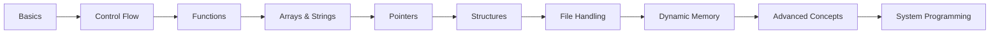

# 🚀 C Roadmap Mastery

<p align="center">
  <b>Master C from Zero → System-Level Programming</b><br>
  A structured, project-based roadmap to become a low-level programming expert.
</p>

<p align="center">
  
  
  
  
</p>

---

## 🧠 About

**C Roadmap Mastery** is not just another repo — it’s a **complete learning system** designed to:

✔ Build strong fundamentals
✔ Master pointers & memory
✔ Understand how programs work internally
✔ Transition into system-level programming

---

## 🗺️ Roadmap Overview



---
Link to GitHub Page - https://srivathsan98.github.io/C-Mastery/Roadmap-Tracker/C-Mastery-Unified-Roadmap-Tracker.html
## 📚 Learning Modules

### 🔰 Basics

* Syntax, variables, data types
* Input/Output
* Operators

### 🔁 Control Flow

* Conditions & loops
* Decision-making logic

### 📦 Functions

* Modular programming
* Recursion

### 🧮 Arrays & Strings

* Data storage & manipulation

### 🧷 Pointers ⚡

> The most important part of C

* Pointer arithmetic
* Memory access
* Arrays & pointers

### 🧱 Structures & Unions

* Custom data modeling

### 📂 File Handling

* Persistent storage

### ⚙️ Dynamic Memory

* `malloc`, `free`, `realloc`

### 🧩 Advanced

* Bitwise ops
* Macros
* CLI args

### 🧵 System Programming

* Stack vs Heap
* Process basics

---

## 🛠️ Projects (Hands-On)

| Project              | Level        | Description         |
| -------------------- | ------------ | ------------------- |
| 🔢 Calculator        | Beginner     | CLI calculator      |
| 📁 File Tool         | Intermediate | File operations     |
| 🧠 Memory Visualizer | Advanced     | Learn memory deeply |
| 🎮 Mini Game         | Advanced     | Logic + structures  |

---

## 📁 Project Structure

```
c-roadmap-mastery/
│
├── 01-basics/
├── 02-control-flow/
├── 03-functions/
├── 04-arrays-strings/
├── 05-pointers/
├── 06-structures/
├── 07-file-handling/
├── 08-dynamic-memory/
├── 09-advanced/
├── 10-system-programming/
├── projects/
└── README.md
```

---

## ⚡ Quick Start

```bash
# Clone the repo
git clone https://github.com/Srivathsan98/C-Mastery.git

# Enter project
cd C-Mastery

# Compile
gcc main.c -o main

# Run
./main
```

---

## 🎯 Goals

* 🧠 Deep understanding of C
* ⚙️ Memory-level thinking
* 🧩 Problem-solving mastery
* 🚀 Build real-world systems

---

## 📈 Progress Tracker

* [ ] Basics
* [ ] Control Flow
* [ ] Functions
* [ ] Arrays & Strings
* [ ] Pointers
* [ ] Structures
* [ ] File Handling
* [ ] Dynamic Memory
* [ ] Advanced Concepts
* [ ] System Programming

---

## 🤝 Contributing

Want to improve this roadmap?

1. Fork the repo
2. Create a branch
3. Submit a PR

---

## ⭐ Support

If this helped you:

👉 Star the repo
👉 Share with others

---

## 📜 License

MIT License

---

<p align="center">
  Built with 💻 + ☕ + curiosity
</p>
